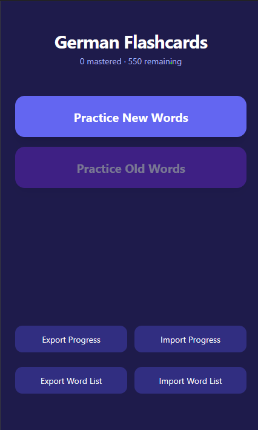
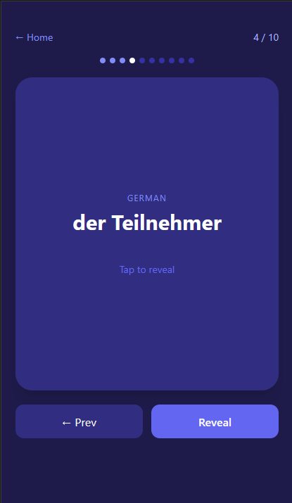
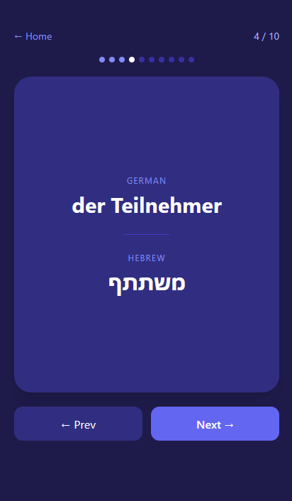
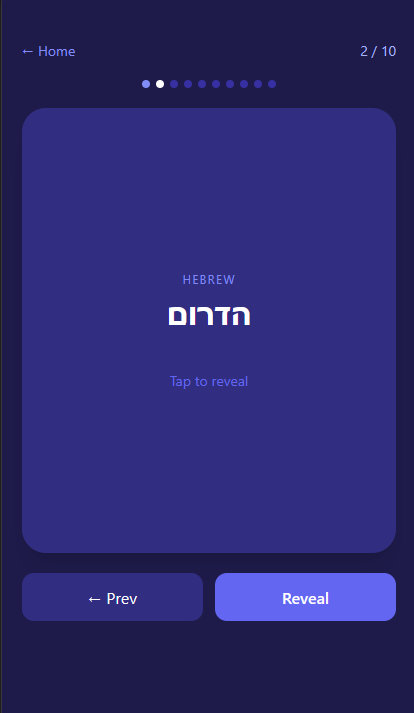
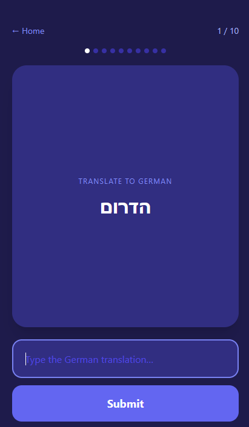
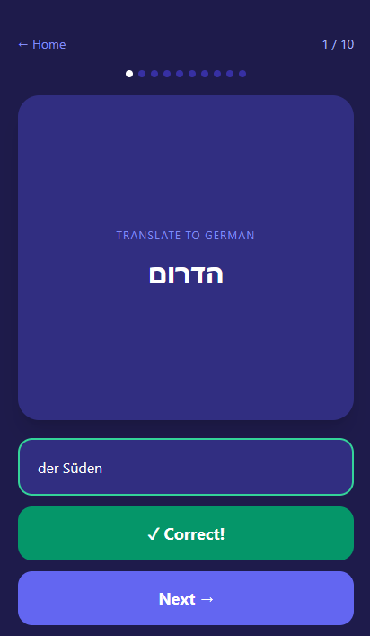
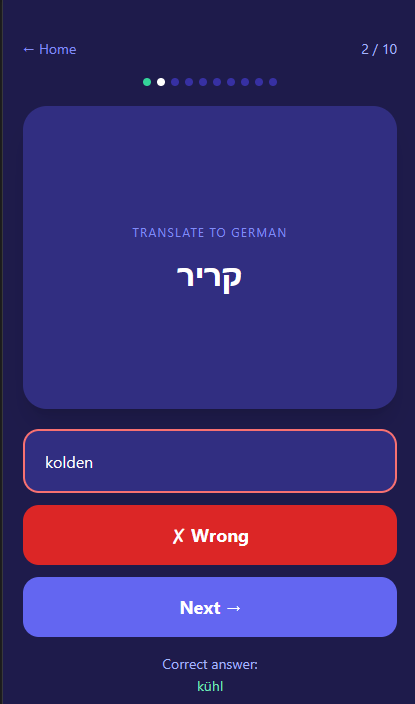

# German / Hebrew Flashcards

A mobile-first PWA for learning German vocabulary with Hebrew translations. Installable on iOS and Android — works offline after first load.

🔗 **[Try it live](https://yonatan-n.github.io/flash-cards/)**


<!--  -->

<!--  -->


<!--  -->


## Features

- **Learn mode** — 10 words per session shown as cards. Tap to reveal the translation.
- **Mixed directions** — some cards show German (you type Hebrew), and some show Hebrew (you type German), so you practice both ways.
- **Test mode** — type the translation, get instant correct/wrong feedback.
- **Progress tracking** — only correctly answered words are marked as mastered. Wrong answers return to the new-words pool automatically.
- **Practice old words** — review your mastered vocabulary in the same learn → test flow.
- **Import / Export progress** — save your progress as a `.json` file and load it on another device.
- **Import / Export word list** — swap in your own `german,hebrew` CSV word list at any time.
- **PWA** — installable to home screen on iOS and Android, runs fullscreen without the browser UI, runs offline after installation.

## Word List

The default word list (`words_clean.csv`) covers the A1–A2 German vocabulary range (~550 words). Format is a simple two-column CSV:

```
german,hebrew
das Haus,בית
gehen,ללכת
```

You can replace it via the **Import Word List** button on the home screen.

## Running Locally / Development

The app fetches `words_clean.csv` at runtime, so it needs an HTTP server — opening `index.html` directly won't work.

Open a local http server, for example:

```bash
python -m http.server 8000
```

Then open `http://localhost:8000`.

## Installing as a PWA

**iOS (Safari):** Share → Add to Home Screen → Add

**Android (Chrome):** Menu (⋮) → Add to Home Screen → Add
